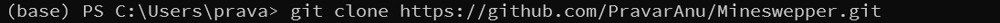
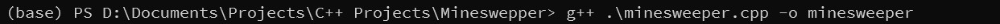
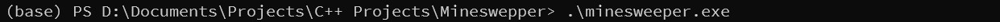
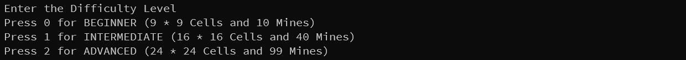
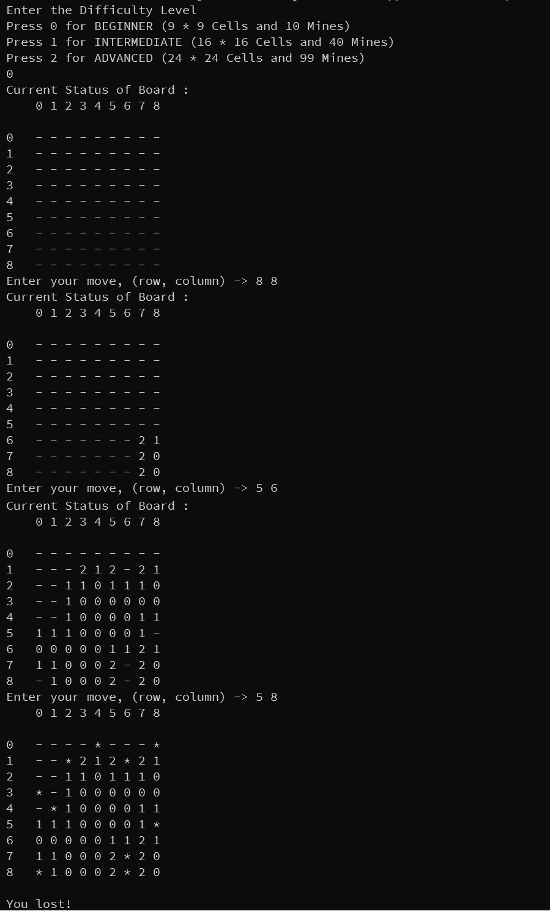

# Mineswepper

    Minesweeper is a game where mines are hidden in a grid of squares. Safe squares have numbers telling you how many mines touch the square. You can use the number clues to solve the game by opening all of the safe squares. If you click on a mine you lose the game!

## Rules to play
- A square's "neighbors" are the squares above, below, left, right, and all 4 diagonals. Squares on the sides of the board or in a corner have fewer neighbors. The board does not wrap around the edges.

- If you open a square with no neighboring mines, all its neighbors will automatically open. This can cause a large area to open up quickly.

- The first square you open is never a mine

- You just need to open all non-mine squares!

- For more information visit [How To Play Mineswepper](https://minesweepergame.com/strategy/how-to-play-minesweeper.php)

# Requirements For This Project
- G++ v5.4 or newer

# How To Run This Project
1. Clone this project to your local machine :
    

2. Go inside the folder where you cloned the project.

3. Compile the code :
    

4. Run the compiled code :
    

5. After this you'll see this:
    

6. You can select among three types of level
    - Beginner level by pressing <kbd>0</kbd> + <kbd>Enter</kbd> .jpg)
    
    - Intermdiate level by pressing <kbd>1</kbd> + <kbd>Enter</kbd> .jpg)

    - Advanced level by pressing <kbd>2</kbd> + <kbd>Enter</kbd> .jpg)

7. Take a look at the gameplay: 
    

## ENJOY THE GAME